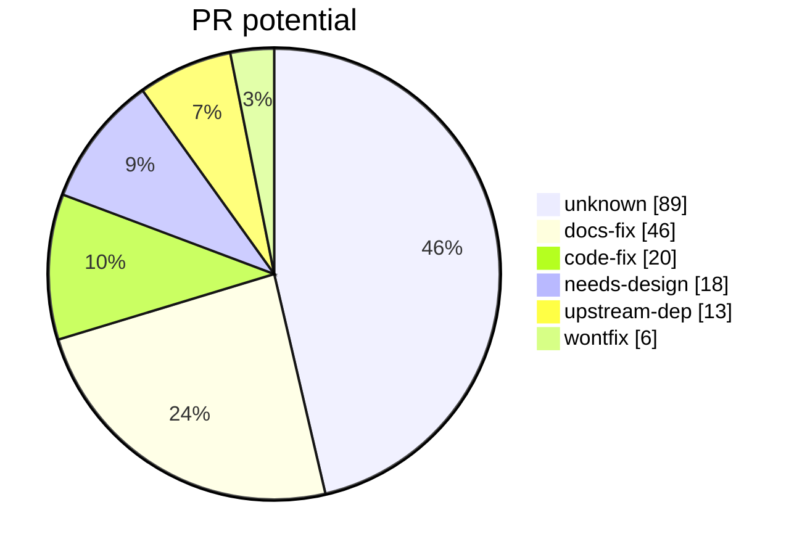

# input-remapper: analysis report

> Generated from database commit `37e1jc5hc9ma` ("incremental change 3", 2026-09-20). Do not edit by hand.

| Corpus | Count |
|---|---|
| Issues and PRs | 1099 (259 are PRs) |
| Analysed so far | 192 |
| Tags applied | 1662 |

## PR potential of analysed issues

## Causes (one page each, generated from the database)

| Cause | Issues |
|---|---|
| [missing-feature](causes/missing-feature.md) | 57 |
| [doc-gap](causes/doc-gap.md) | 37 |
| [distro-compat](causes/distro-compat.md) | 33 |
| [device-quirk](causes/device-quirk.md) | 23 |
| [de-compat](causes/de-compat.md) | 21 |
| [permission](causes/permission.md) | 12 |
| [wayland-issue](causes/wayland-issue.md) | 12 |
| [x11-issue](causes/x11-issue.md) | 12 |
| [autoload-failure](causes/autoload-failure.md) | 9 |
| [macro-logic](causes/macro-logic.md) | 7 |
| [symbol-mapping](causes/symbol-mapping.md) | 6 |
| [config-error](causes/config-error.md) | 5 |
| [evdev-api](causes/evdev-api.md) | 4 |
| [python-version](causes/python-version.md) | 4 |
| [ui-logic](causes/ui-logic.md) | 4 |
| [race-condition](causes/race-condition.md) | 3 |
| [unknown](causes/unknown.md) | 3 |
| [regression](causes/regression.md) | 2 |
| [combination-logic](causes/combination-logic.md) | 1 |
| [uinput-api](causes/uinput-api.md) | 1 |

## Layers

| Layer | Issues |
|---|---|
| injector | 33 |
| install | 33 |
| macro | 31 |
| daemon | 27 |
| mapping | 27 |
| device | 20 |
| gui | 19 |
| reader | 18 |
| permissions | 9 |
| config | 8 |
| combination | 5 |
| docs | 1 |

See the [triage queue](triage.md) for issues a docs or code change could close.
